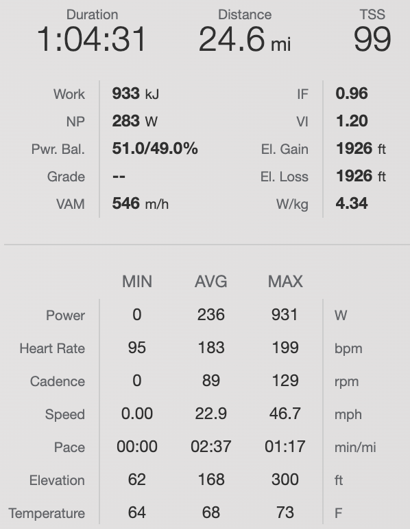


../assets/carousels/2022-07-03/at_race.jpg
../assets/carousels/2022-07-03/at_race2.jpg
../assets/carousels/2022-07-03/bikewash.jpg
../assets/carousels/2022-07-03/video.mov



## Pre Race

**Nutrition**
- Cereal
- Leftovers from the night before
- Juice
- Water

**Preparation**
- Took mental notes from yesterday's race
- Pre-rode the course a bit

**Goals**
- To put into effect what I had learned from the first kermis
- To (hopefully) finish with the rest of the pack

## Pre Start (At the race)

**Warmup**
- 1 Hr @Z1-2
  - Ride to race
  - Lap of the course

**Jersey Pockets**
- 3 SIS gels
- 1 bag of Extreme sports beans
- Phone

**The Course**
- Super hilly, with one super punchy uphill and one more steady Vo2 type effort
- Not as many twists and turns, but there was one chicane on a small farm road that was a bit trippy
- Beautiful course 10/10 will do a ride over that way in the future

## Race Summary

Started out chill-ish like the day before but for more of a half lap than a full lap. Super punchy especially with this one screaming descent into a sharp left-hander. Then a bit later on there was this really difficult 3 minute climb we'd rip up every lap. Super fun, but also super hard. With that kind of effort every lap I hung in for about an hour which I believe was 6 laps. Even though I was much better about positioning today I was losing wheels out of the insanely punchy climbs simply because I could not hold the wheel. I guess I have yet to get that sort of effort into my legs.

### Race Data

## Post Race Notes

**What I Did Well**
- Moved through the group a lot more comfortably
- Made sure to follow good wheels (Hagen's Berman, Alpecin Fenix, Lotto)

**What I Need to Work On**
- Eating food when I'm hungry
- Really fighting for the wheel through a corner
- Not letting any gap open up at all

## Links

- [Results Sheet](https://cycling.vlaanderen//competitie/uitslagen/detail?date=2022-07-03&key=5352)
- [Strava Ride](https://www.strava.com/activities/7408821052)
