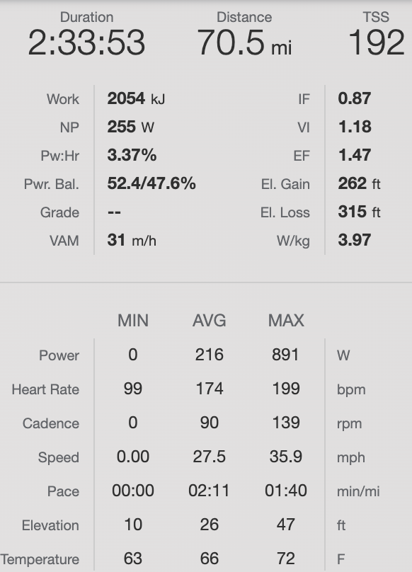

## Pre Race

**Nutrition**
- Leftovers
  - Ground beef
  - Potatoes

**Preparation**
- Lots of sleep, rest
- Thinking about how I could improve my rest and recovery
- Looking over notes on how I could improve

**Goals**
- Stay in for the whole race

## Pre Start (At the race)

**Warmup**
- 35 minutes @ Z1-2

**Jersey Pockets**
- 4 SIS Gels
- 1 bag Extreme Jelly Beans
- Phone

**The Course**
- Flat, not super techincal but sharp enough turns to sprint out of

## Race Summary

I stayed in the whole race this time :) . It was pretty flat and more similar to a lot of crits that I've done in SoCal, so I was able to be a bit more comfortable. What I didn't expect however was how split up everything got. In the last few laps the race totally split up with riders all several minutes apart from one another and it looked like quite the frenzy. Something to expect for the next time around.

### Race Data

## Post Race Notes

**What I Did Well**
- Stayed in the group the entire race
- Conserved pretty well
- Stayed safe for the most part
- Moved to where I wanted to be in the pack

**What I Need to Work On**
- Staying in the right place in order to follow properly
- Follow wheels a bit more efficiently
- Not let gaps open up as much
- Eat more

## Links

- [Results Sheet](https://cycling.vlaanderen//competitie/uitslagen/detail?date=2022-07-05&key=5349)
- [Strava Ride](https://www.strava.com/activities/7419831642)

## Media


