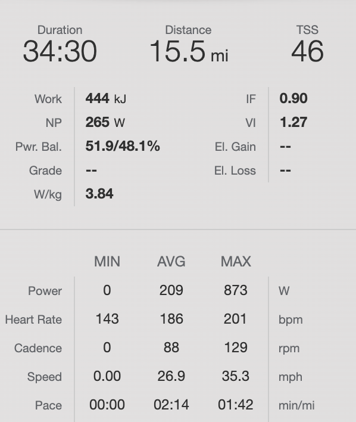

## Pre Race

**Nutrition**
- Cereal
- Caffeinated Sports Beans

**Preparation**
Not a whole lot other than recovering from sickness. Really was just focused on the experience rather than actually performing today.

**Goals**
- Staying upright

## Pre Start (At the race)

**Warmup**
- 30-35 min @ Z1-2

**Jersey Pockets**
- 3 SIS Gels
- 2 packets caffeinated sports beans
- Phone

**The Course**
Flat, not super techincal at slower speeds but definitely had to pay attention at race pace. Not a whole lot of turns. There was one spooky section where there was a sharp right hand turn into cobbles and then another right hander just after that but not super techincal other than that.

## Race Summary
Did not go well. I lasted about 30 minutes. Started off super jittery likely from being super fresh after not riding for 3 days and eating a bunch of caffeinated sports beans. The whole time I was in the race I felt really weird like I was almost sleep walking which wasn't a super great combination with everyone bunching up towards the beginning of the race. Although my average hr was super high at 186bpm it didn't feel super hard. In fact it felt like the easiest kermis so far, but I think coming off of 3-4 days of no riding and sickness I was less than prepared. Good learning experience.

### Race Data

## Post Race Notes

**What I Did Well**
- Stayed towards the front for like the first 15-20 minutes
- Knew when to back off since I wasn't feeling super good

**What I Need to Work On**
- Getting to the front a bit quicker
- Following breaks rather than "conserving"; breaks turn into the main field
- Not telling myself that sitting behind is ok because things are going somewhat chill; it will not be chill forever, and the back is also where crashes happen

## Links

- [Results Sheet](https://cycling.vlaanderen//competitie/uitslagen/detail?date=2022-07-11&key=5417)
- [Strava Ride](https://www.strava.com/activities/7451108614)
